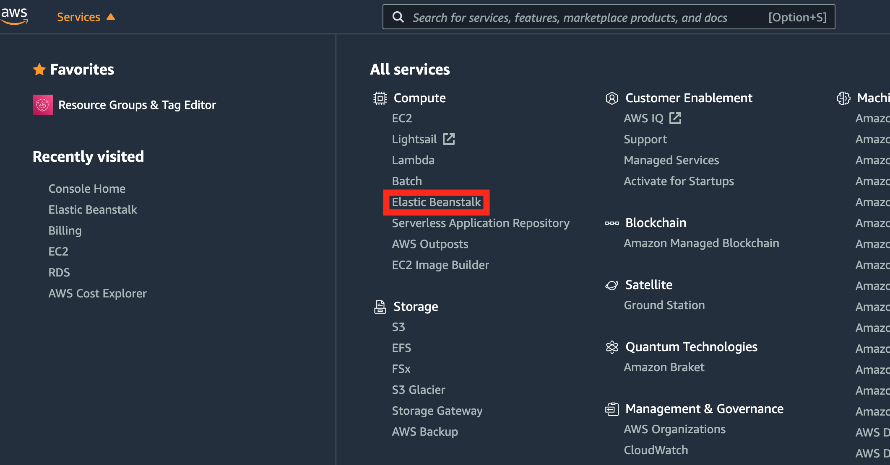

# Elastic Beanstalk Account Creation Guide

## Overview

Elastic Beanstalk runs on top of AWS infrastructure and requires an AWS account. This guide outlines the steps necessary to create an AWS account.

Please note that while there is no charge for Elastic Beanstalk, there are charges for use of the underlying AWS components. At the time this guide was written, each new AWS account included 12 months of AWS Free Tier access. It is your responsibility to ensure that your resource usage does not exceed the terms of the Free Tier offer (see details here: [**aws.amazon.com/free**](aws.amazon.com/free)). **Resource usage that exceeds the Free Tier offer will result in charges to your credit card.**

## Account Signup

Go to [https://portal.aws.amazon.com/billing/signup#/start](https://portal.aws.amazon.com/billing/signup#/start).

1. Provide the following:

   1. Email Address
   2. Password
   3. AWS Account Name you would like for your account

2. Provide your contact information. Select Personal as the Account Type.

3. Provide your credit card information and billing address.

4. Confirm your identity via text or voice call.

5. Select the **Basic Plan (Free)**

6. Sign in to the Console (sign in as the Root user).

7. Click on the **Services** menu found at the upper left of the screen.

   

8. Choose **Elastic Beanstalk** under the **Compute** heading.

   

9. **Congratulations!** You have successfully created a new AWS account and have accessed the Elastic Beanstalk Console.

---

© 2019 Trilogy Education Services