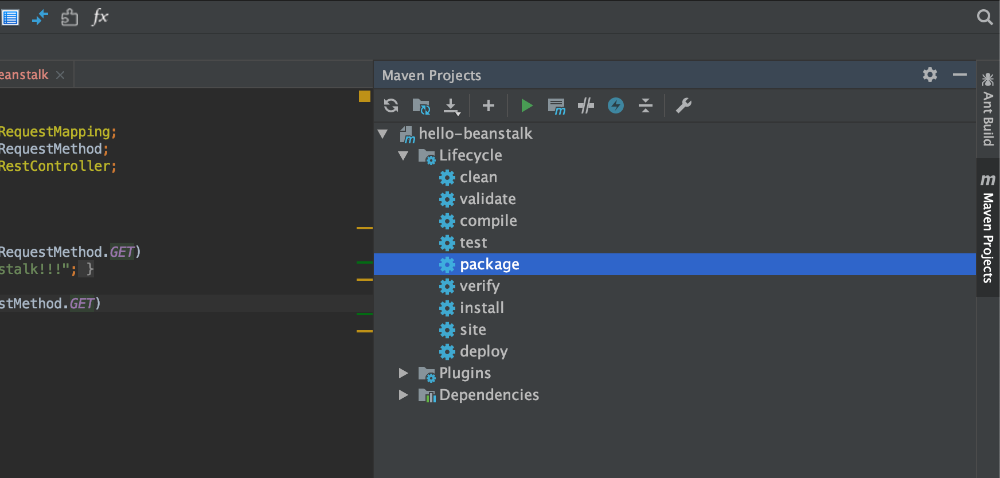
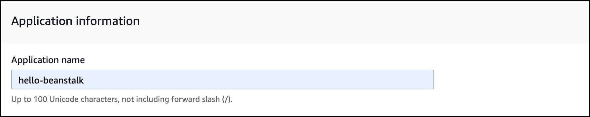
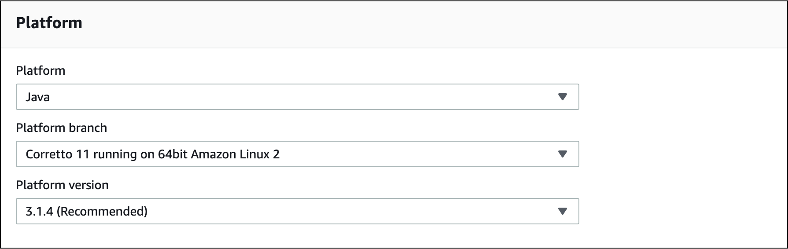

# Hello Beanstalk Tutorial

The purpose of this tutorial is to have you deploy a simple web service to Elastic Beanstalk.

This assumes that you have successfully created an AWS account and have accessed the Elastic Beanstalk Console. If that is not the case, complete the **Elastic Beanstalk Account Creation Guide** located in this lesson.

You will need:

* Internet connection
* AWS account
* Elastic Beanstalk Console
* Spring Initializr (start.spring.io)
* Intellij IDEA Community Edition
* Java 8 (or greater) JDK

## Building the System

We'll build the system in the following steps:

1. Create Hello Beanstalk web service project locally
2. Create controller
3. Run Hello Beanstalk locally
4. Build and package Hello Beanstalk service
5. Deploy Hello Beanstalk to Elastic Beanstalk
6. Access the service running on Elastic Beanstalk
7. Terminate the Elastic Beanstalk Environment

## Step 1: Create the Project

Step 1 is to create the application. We'll use the Spring Initializr to create our project. Go to [start.spring.io](https://start.spring.io/) and enter the following information:

- Group = com.trilogyed
- Artifact = hello-beanstalk
- Dependencies = Spring Web Starter

Download the project, copy it into your working directory, and open the project in IntelliJ.

## Step 2: Create Controller

Now we will create a controller that contains a simple "hello" endpoint. Create a new Java class called `com.trilogyed.hellobeanstalk.HelloController` and add the following code:

```java
@RestController
public class HelloController {

    @RequestMapping(value = "/hello", method = RequestMethod.GET)
    public String hello() {
        return "Hello, Beanstalk!!!";
    }
}
```

## Step 3: Run Hello Beanstalk Locally

Next, run Hello Beanstalk with IntelliJ. Open a browser and visit `http://localhost:8080/hello` to make sure your web service is working properly. You should see `Hello, Beanstalk!!!` in your browser.

## Step 4: Build and Package Hello Beanstalk Service

We must build and package our service before we deploy it to Elastic Beanstalk. We'll use Maven to do this. Open the Maven window in IntelliJ by clicking on the Maven tab toward the top of the right side of your IDE. It should display the following:


Now expand the **Lifecycle** menu item and then double-click on the **package** item. This will build the project and package it into an executable JAR file. This JAR file contains the application *and* the Tomcat servlet container in which our application will run. The JAR file will be placed in the `target` directory of your project.



## Step 5: Deploy to Elastic Beanstalk

### 5.1 Log Into AWS and Access Elastic Beanstalk

Now  we will deploy our service to Elastic Beanstalk. First, log into your AWS account at [console.aws.amazon.com](console.aws.amazon.com). Navigate to Elastic Beanstalk by clicking on the Services drop down and the clicking on the Elastic Beanstalk link as shown below:


### 5.2 Create Application

Now that we're logged in, our next step is to create a new application. Click on the Create Application button as shown below:


#### 5.2.1 Application Information: Application Name

Enter **hello-beanstalk** in the Application name box:



#### 5.2.2 Platform

Next, we specify the Platform we want to use (skip the Application tags section). Select **Java** from the **Platform** drop-down. This will fill in the default values for **Platform branch** and **Platform version**. Use the supplied default values. Your default values may be different than those shown below, as Amazon may have deployed new versions since the writing of this lesson.



#### 5.2.3 Application Code and Source Code Origin

Select **Upload your code** in the **Application code** section. This will display the **Source code origin** section. Use the default value of **hello-beanstalk-source** in the **Version label**. Click on the **Choose file** button, navigate to the JAR file you built in Step 4 and upload it to Elastic Beanstalk:


#### 5.2.4 Create the Application

Finally, click on the **Create application** button at the bottom of the screen:


This will kick off the application and environment creation process, which will take several minutes. Your screen should look similar to this as the process is running:


The Hello Beanstalk environment screen will be displayed when the creation process has completed. It should look similar to the following. 

**Note: The Severe Health error is expected. We will fix that when we configure our load balancer in the next step.**


### 5.3 Configure Load Balancer

Elastic Beanstalk web server environments include an infrastructure component called a **load balancer**. A load balancer listens for incoming HTTP requests on port 80 and then reroutes them back to our web application (in this case Hello Beanstalk). Load balancers are important components that allow Elastic Beanstalk applications to scale. As an application grows, more application environment instances can be created to add capacity. The load balancer distributes traffic among the application environment instances. 

Our Hello Beanstalk Spring Boot application is listening on the default port of 8080. Although we have only one application environment instance we still must configure the load balancer so that it properly reroutes incoming requests to our Spring Boot web service running in the environment instance. Once configured, our environment will look like this:


#### 5.3.1 Configuration Screen

Click on the **Configuration** link in the Elastic Beanstalk menu at the left of your screen:


The configuration screen should now be displayed. 

Now click the **Edit** button under the Load balancer option as shown below:


#### 5.3.2 Modify Application Load Balancer

The **Modify Application Load Balancer** screen should now be displayed. The **Listeners** section configures how the load balancer will listen for incoming requests. It defaults to listening for HTTP requests on port 80. This is the configuration that we want for our application so leave this section alone.

The **Processes** section configures how the load balancer will route requests to our Spring Boot web service. By default it routes requests to our application on port 80. This does not work for us because our web service is listening on port 8080. This mismatch is the cause of the Health error we saw in Section 5.2.4 above. We will fix this now.

Click the checkbox beside the default process in the Process section as shown here:


Now click the Action dropdown and select Edit as shown here:


This will display the **Environment process** dialog box. Change the following values as shown below and click the Save button:

* Port: 8080 
* HTTP code: 200
* Path: /hello 


Now scroll down to the bottom of the **Modify Application Load Balancer** screen and click the Apply button:


Now the load balancer is configured to route traffic to the Spring Boot web service properly. It will take Elastic Beanstalk several minutes to apply these changes to the environment. The Hello Beanstalk environment page will be displayed after the changes have been applied. The Health error encountered in Step 5.2.4 above should now be fixed:


## Step 6: Access Hello Beanstalk Web Service

Finally, we can visit the `hello` endpoint of the web service we just deployed and configured. The URL for the web service is displayed on the environment screen:


Click on your web service URL and add "/hello" to the end, for example:

http://hellobeanstalk-env.eba-8dhhrzxn.us-west-2.elasticbeanstalk.com/hello

**Hello, Beanstalk!!!** should be displayed in your browser.

Congratulations! You have successfully deployed and configured a Spring Boot web service to Elastic Beanstalk!

## Step 7: Terminate Environment

Now we will terminate the Hello Beanstalk environment so that it doesn't continue to use AWS resource behind the scenes.

Click on the Environments link in the left-hand menu which will display the All Environments page


Select the Hello Beanstalk environment from the table and choose Terminate environment from the Actions drop down:


Confirm that you want to terminate the environment and click the Terminate button:


This concludes the tutorial.