# RSVP Deploy Tutorial

The purpose of this tutorial is to step you through the deployment of a MySQL backed web service on Elastic Beanstalk.

You will need:

* Internet connection
* AWS account
* Elastic Beanstalk Console
* Spring Initializr (start.spring.io)
* Intellij IDEA Community Edition
* MySQL Workbench
* Java 8 (or greater) JDK

## Deploying Configuring the System

We will deploy and configure the RSVP service in the following steps:

1. Review the database configuration in the `application.properties` 
2. Build and package the RSVP service
3. Deploy the RSVP service to Elastic Beanstalk
4. Create MySQL database instance for the RSVP service Elastic Beanstalk environment
5. Configure RSVP service Elastic Beanstalk database instance for remote access via MySQL Workbench
6. Create RSVP database table
7. Access RSVP service running on Elastic Beanstalk
8. Terminate the RSVP service environment

## Step 1: Review Database Configuration

Our first step is to review the database configuration entries in the `application.properties` file. This file has been modified so the settings will work with the MySQL database in the Elastic Beanstalk environment.

Elastic Beanstalk holds database configuration values in environment variables. The database connection configuration has been modified to use the following Elastic Beanstalk environment variables:

* `RDS_HOSTNAME`: hostname of the MySQL instance
* `RDS_PORT`: port of the MySQL instance
* `RDS_DB_NAME`: database name
* `RDS_USERNAME`: database username
* `RDS_PASSWORD`: database password

You must configure your database connection entries as shown below any time you are deploying an application to Elastic Beanstalk:

```properties
spring.datasource.url: jdbc:mysql://${RDS_HOSTNAME}:${RDS_PORT}/${RDS_DB_NAME}?useSSL=false

spring.datasource.username: ${RDS_USERNAME}
spring.datasource.password: ${RDS_PASSWORD}
spring.datasource.driver-class-name: com.mysql.jdbc.Driver

```

## Step 2: Build and Package RSVP Service

Now we will build and package our service so we can deploy it to Elastic Beanstalk.

Open a command prompt or terminal window and change directories to the root of the RSVP project supplied with this lesson. Run the following command to build and package the service:

```
./mvnw -DskipTests=true package
```

NOTE: If you still have a local version of the RSVP database you don't have to skip the tests.

## Step 3: Deploy RSVP Service to Elastic Beanstalk

Now we will deploy our service to Elastic Beanstalk. Follow Steps 5.1 - 5.3 in the **Hello Beanstalk Tutorial** to deploy your RSVP service.

All steps are this same with the following exceptions:

* Step 5.2.1: Enter **rsvp-service** for the Application name instead of hello-beanstalk

* Step 5.2.3: Upload the RSVP service JAR file you created in Step 2 above instead of the Hello Beanstalk JAR file

* Step 5.3.2: Environment Process Dialog Box: Fill in the Port, HTTP code, and Path with the values shown below:

  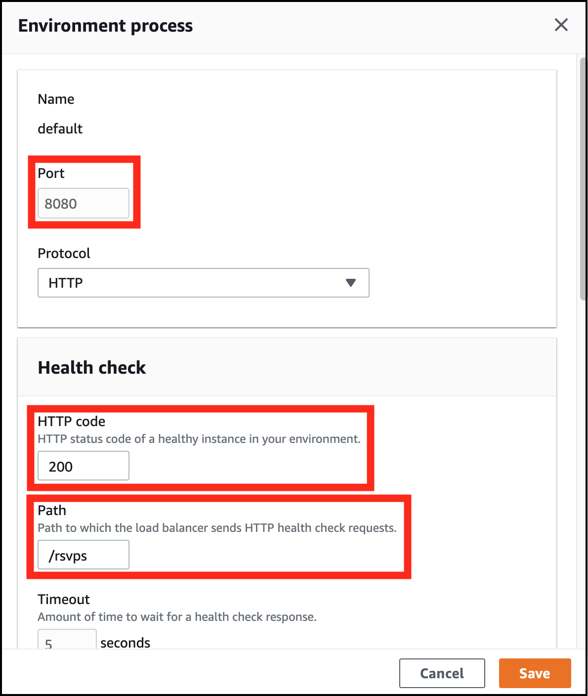

  The **HTTP code** and **Path** entries tell Elastic Beanstalk what endpoint it should access on our service to check to see if it is up and running. We did not have to supply this information for the Hello Beanstalk service because the path `/` did not return an HTTP error code. 

  Because the `/` path of the RSVP service is not valid and returns a 404 Not Found HTTP error code it cannot be used as a health check endpoint. We must supply a valid endpoint that can be used to check the health of our application. In this case, we choose `/rsvps`, which will always return a 200 OK HTTP code when the service is running properly.

**Note: Your environment will still have a Severe Health Error after completion of Steps 5.1 - 5.3 of the Hello Beanstalk tutorial. This is expected and will be addressed in Steps 4 - 6 below.**

## Step 4: Create MySQL Database Instance

Next, we will create a MySQL database instance in the RSVP Service environment.

Click on the **Configuration** link in the Elastic Beanstalk menu on the left of your screen:

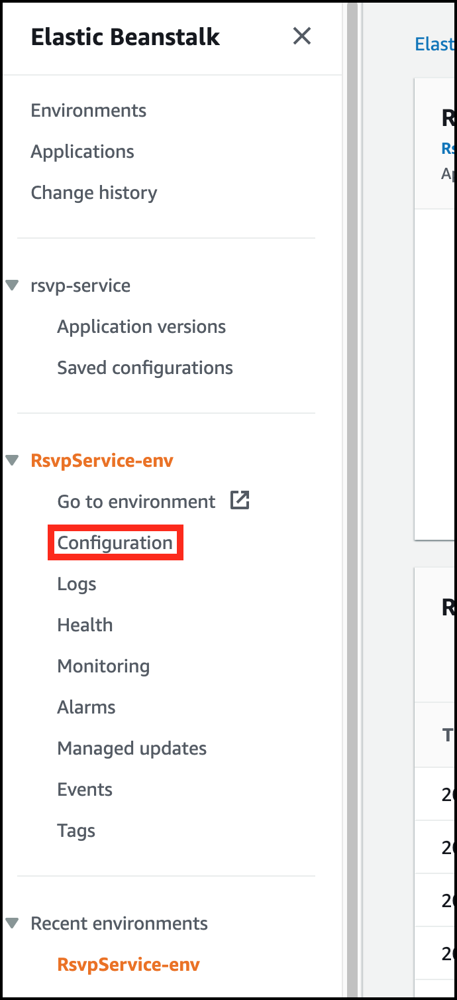

The Configuration overview screen should now be displayed. 

Now click the **Edit** button under the Database option as shown below:

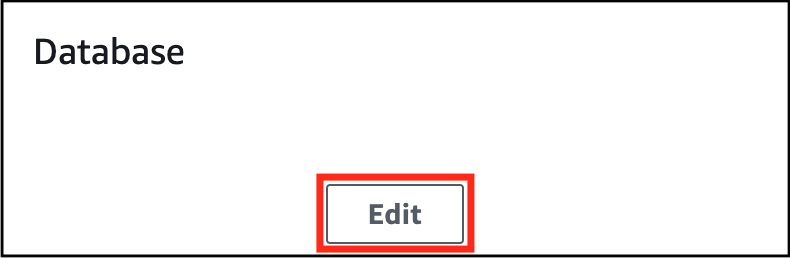

The **Modify database** screen should now be displayed. Fill in the form with the following values (many of these will be supplied as defaults):

* **Snapshot**: None
* **Engine**: mysql
* **Engine version**: 8.0.20
* **Instance class**: db.t2.micro
* **Storage**: 5GB
* **Username**: root (we use this value only for class, it is not appropriate for a production environment)
* **Password**: rootroot (we use this value only for class, it is not appopriate for a production environment)
* **Retention**: Create snapshot
* **Availability**: Low (one AZ)

Click the **Apply** button at the bottom of the screen to create the database instance. 

**Note: Your environment will still have the Severe Health Error at this point.**

## Step 5: Configure MySQL Database Instance for Remote Access

We have a MySQL database instance now but we still must create the database table for our application. To do this, we must be able to access the database remotely and run SQL commands. This requires a change in the network security access rules for our database.

Click the configuration in the Elastic Beanstalk menu on the leftof your screen (as you did in Step 4 above). Once the Configuration overview screen is displayed, scroll down to the Database option and click the Endpoint link as show below:

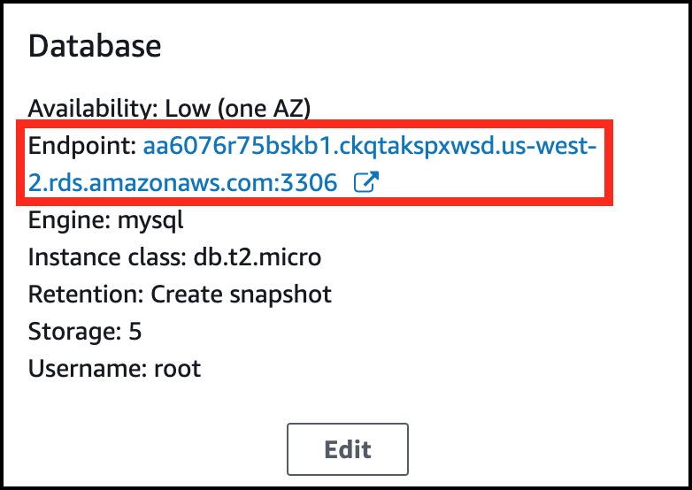

This will take you to the Amazon Relational Database Service (Amazon RDS) Databases page. Click on the DB identifier link for your database as shown below:

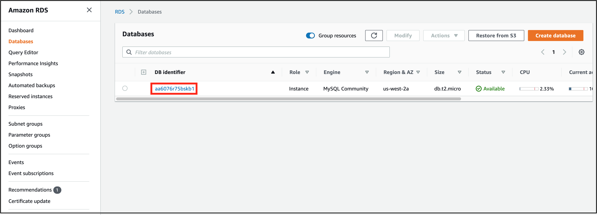

This will display the details for your database instance. Scroll down to the **Security group rules** section and click on the link for the **EC2 Security Group - Inbound** type as shown below:

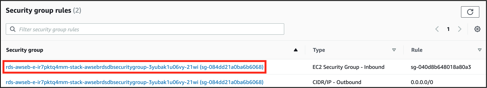

This displays the **EC2 Dashboard Security Groups** screen. Select the checkbox of the Security Group in the table and choose the **Edit inbound rules** option from the Actions dropdown and shown below:

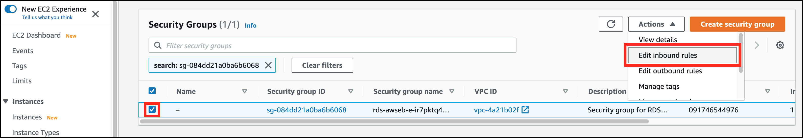

We have finally arrived at the screen that allows us to add an inbound traffic rule to allow connections to the database from your laptop. Click on the **Add rule** button as shown below:

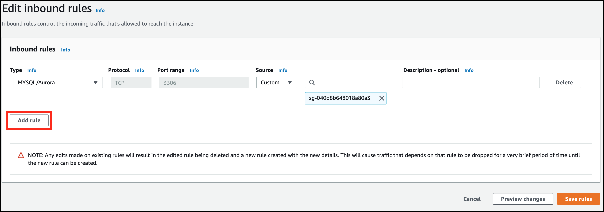

Fill in the details of the new rule with the following values:


And now click the **Save rules** button. Your database instance is now accessible from your IP address. You can access the database via the Endpoint URL that is displayed on your environment's Configuration overview page in the Database section as shown here:


**Note: You will need the Endpoint URL when setting up the MySQL Workbench connection in Step 6.**

## Step 6: Create RSVP Database Table

Now we will create the RSVP database table in the MySQL instance running on Elastic Beanstalk.

### Step 6.1: Connect MySQL Workbench to Database Instance

Before we can create the table in the database instance, we must configure MySQL Workbench to connect to the instance.

Start the MySQL Workbench application on your laptop. Click on the + button beside the MySQL Connections label as shown below:

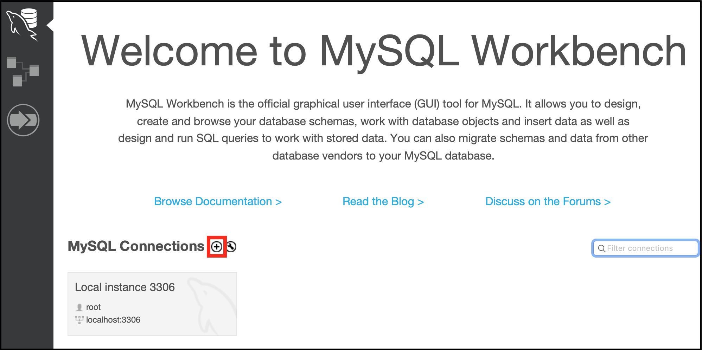

This will display the Setup New Connection dialog. Fill in the following values:

* **Connection Name**: RSVP Database
* **Connection Method**: Standard (TCP/IP)
* **Hostname**: The URL for your database (as shown in the Database configuration details as shown at the end of Step 5 above) **Make sure to leave off the :3306 portion of the URL!!!**
* **Port**: 3306
* **Username**: root
* **Password**: rootroot
* **Default Schema**: Leave blank

Your dialog box should look similar to this:

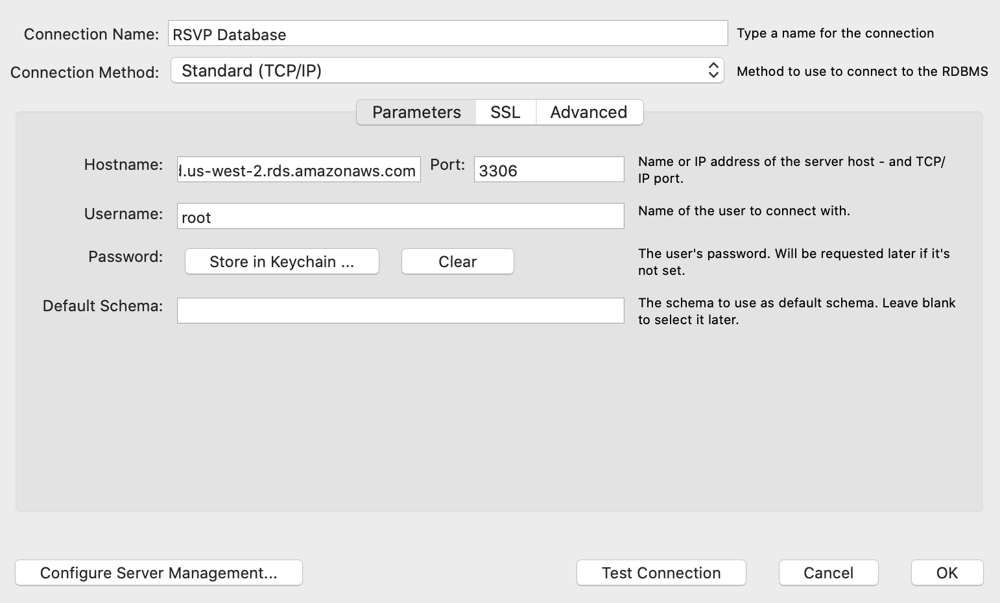

Click the **Test Connection** button. If all connection information was entered correctly you will see the success dialog shown below. If you do not see this dialog, double check your connection information.

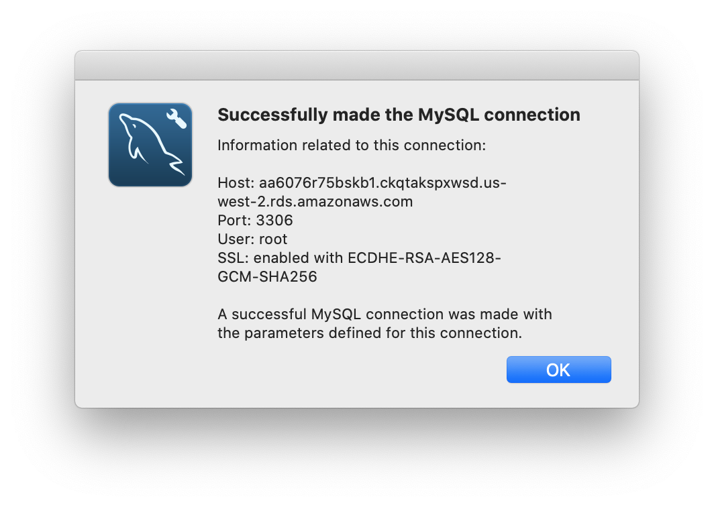


### Step 6.2: Create Table

Now we can create the database table for the RSVP service. Access your remote MySQL instance by clicking on the newly created connection:

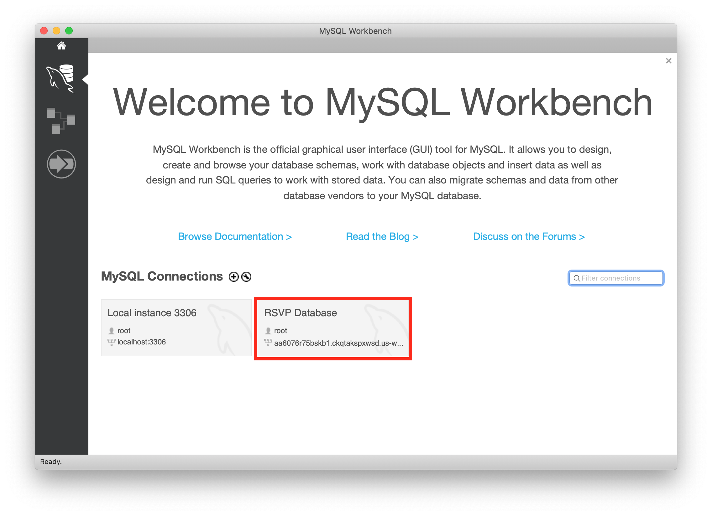

After you have successfully connected, run the following SQL script in the SQL Editor.
Be sure to add your database name to the `use` command in the script below. For example `use ebdb;`

```sql
use ; -- enter then name of the database here (it's in the Schemas pane)
create table if not exists rsvp (
	rsvp_id int not null auto_increment primary key,
    guest_name varchar(50) not null,
    total_attending int not null
);
```

**Note: Now that the database is in place, the Severe Health Error should be resolved for your environment.**

## Step 7: Access RSVP Service

Now we can exercise the RSVP service. The RSVP service as the following API:

```
Create RSVP
===========
URL: /rsvps
HTTP Method: POST
RequestBody: RSVP data
ResponseBody: RSVP data + ID

Get RSVP
========
URL: /rsvps/{id}
HTTP Method: GET
RequestBody: None
ResponseBody: RSVP data

Get All RSVPs
=============
URL: /rsvps
HTTP Method: GET
RequestBody: None
ResponseBody: Array of RSVP data

Update RSVP
===========
URL: /rsvps/{id}
HTTP Method: PUT
RequestBody: RSVP data
ResponseBody: None

Delete RSVP
===========
URL: /rsvps/{id}
HTTP Method: DELETE
RequestBody: None
ResponseBody: None
```

And each RSVP has the following fields:

```
ID: int
guestName: String
totalAttending: int
```

### Step 7.1 Add an RSVP

Now we will add some data to our service. Open Postman, create, and execute the following POST request that creates a new RSVP entry.

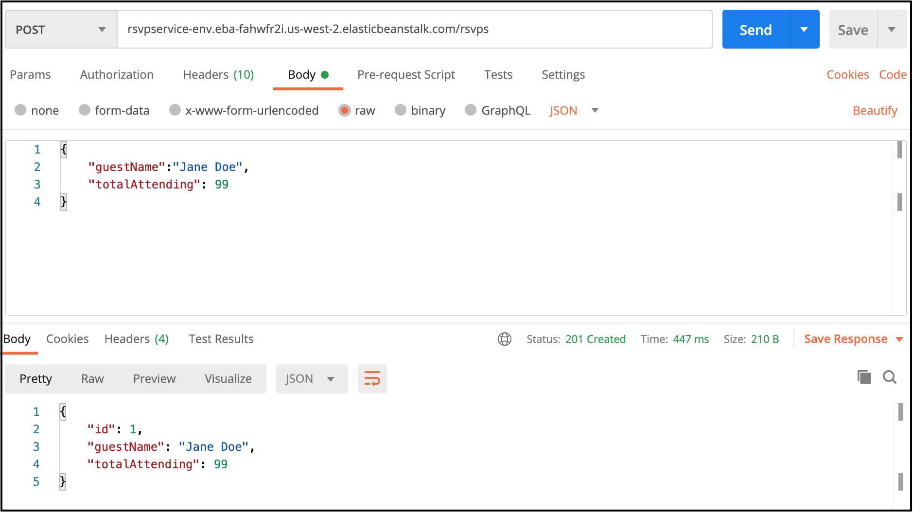

**NOTE: Substitue the URL for your RSVP service instead of the URL contained in the image.**

### Step 7.2 Get All RSVPs

Next we'll get all the RSVPs from the service to make sure we see the RSVP we just created. Create and execute the following GET request in Postman:

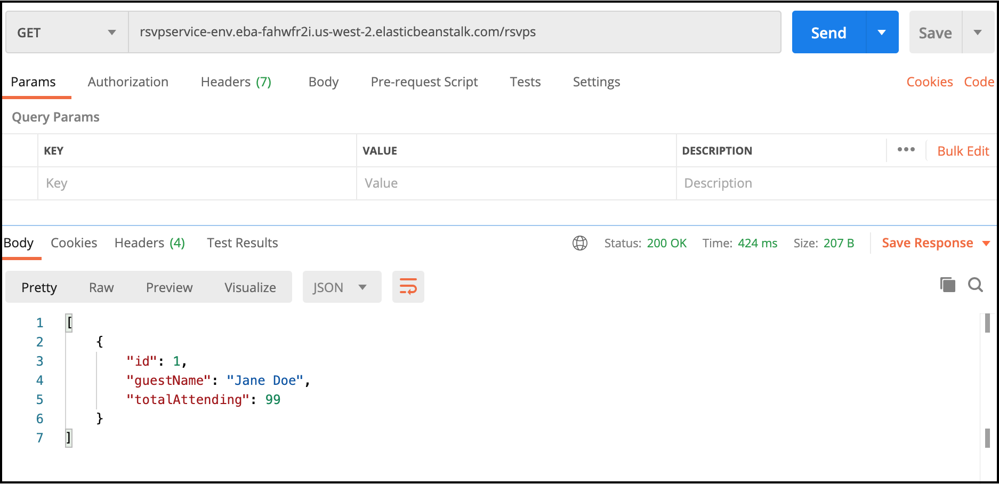

**NOTE: Substitue the URL for your RSVP service instead of the URL contained in the image.**

### Step 7.3 Look at RSVP Table

Finally, we'll look at the rsvp table using MySQL Workbench. Go back to MySQL Workbench, expand the **Tables** tab under the **ebdb** schema, right click on the **rsvp** table, and click on the **Select Rows - Limit 1000** option as shown below:

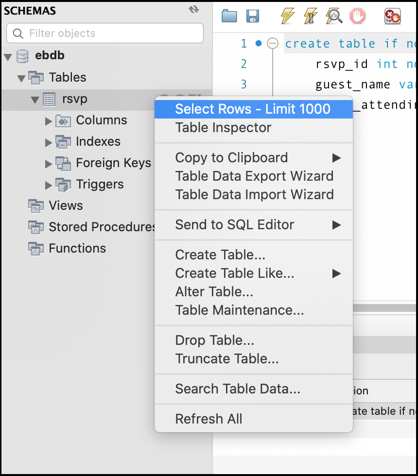

You should see the following in the results grid:

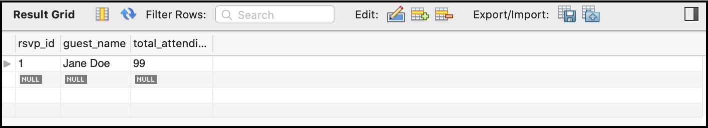

Congratulations! You have successfully deployed your MySQL backed RSVP service to Elastic Beanstalk!

## Step 8: Terminate Environment

Now terminate your RSVP environment by following the instructions in Step 7 of the Hello Beanstalk Tutorial. 